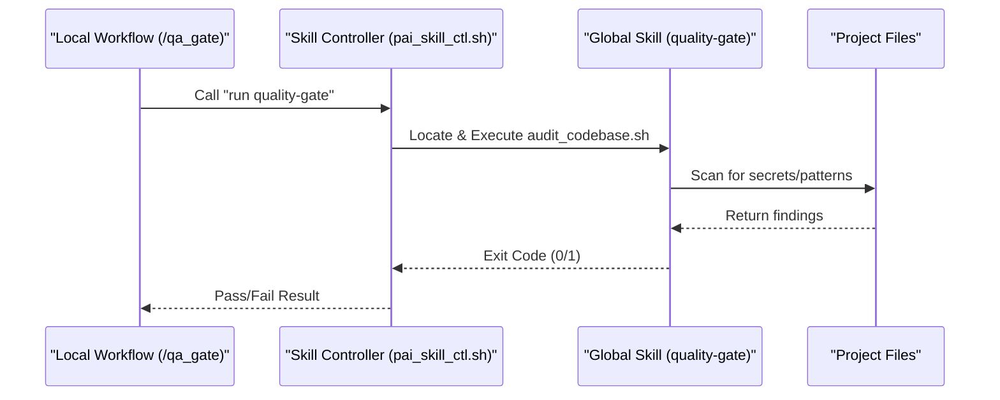
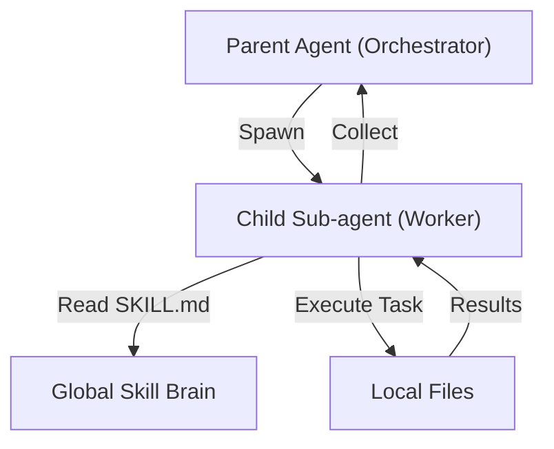
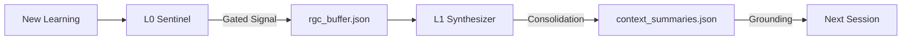
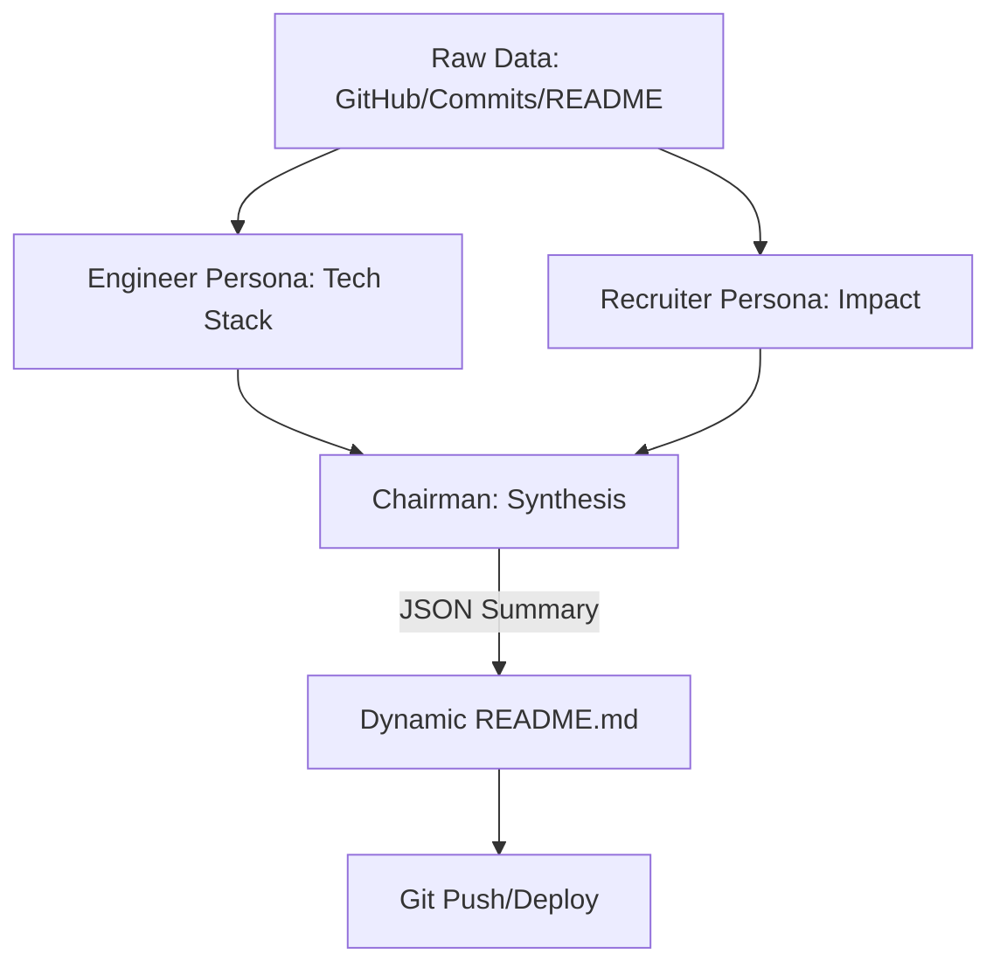
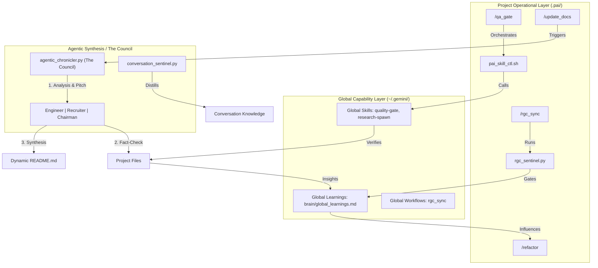

# PAI v2.2 System Architecture — Portfolio-Fetch

This document outlines the architectural blueprint of the Personal AI Infrastructure (PAI) v2.2 ecosystem within the `Portfolio-Fetch` project and its global counterpart.

## 1. Core Philosophy: The Two Loops
The system operates on a "Two Loops" model:
- **Outer Loop (Strategic):** Managed via `.pai/manifest.md` and ADRs. Defines the "Why" and "What."
- **Inner Loop (Execution):** Managed via Workflows and Sub-agents. Defines the "How."

## 2. Infrastructure Tiers

### A. Global Infrastructure (`~/.gemini/`)
The Global Brain stores "Capability Primitives" that are shared across all projects.

| Component | Path | Description |
| :--- | :--- | :--- |
| **Skills** | `~/.gemini/antigravity/skills/` | Specialist "specialties" (e.g., `quality-gate`). |
| **Workflows** | `~/.gemini/workflows/` | Hardened, project-agnostic rituals (e.g., `rgc_sync`). |
| **Global Brain** | `~/.gemini/brain/` | Cross-project learnings (`global_learnings.md`). |

### B. Project-Local Layer (`Portfolio-Fetch/.pai/`)
Local memory and project-specific orchestration.

| Directory | Description |
| :--- | :--- |
| `.pai/manifest.md` | The North Star/Goals of this specific project. |
| `.pai/decisions/` | Architectural Decision Records (ADR). |
| `.pai/tasks/` | Session-level tracking (`todo.md`). |
| `.pai/state/` | Persistent context summaries (RGC storage). |

## 3. Interaction Mechanics

### A. The Skill-Workflow Bridge
Standardized capabilities are injected into project rituals using a **Skill Controller**.

### B. Sub-agent Lifecycle
Hierarchical delegation for complex or parallel work.

### C. The RGC Sync Loop
Recursive Gated Consolidation ensures long-term memory doesn't "decay."

### D. The Agentic Chronicler (Docs Sync)
The `/update_docs` workflow utilizes an "LLM Council" to synthesize project reality into human-readable portfolios.

## 4. Holistic Interaction Map
How all components work together to provide a robust, self-healing mechanism across projects.

## 5. Key Tooling
- `scripts/pai_skill_ctl.sh`: Proxies local requests to global skills.
- `scripts/pai_subagent_ctl.sh`: Manages the lifecycle of child workers.
- `scripts/rgc/`: Powering the sentinel and synthesizer loops.
- `scripts/agentic_chronicler.py`: The LLM Council for documentation synthesis.

---
*Last Updated: 2026-03-01*
