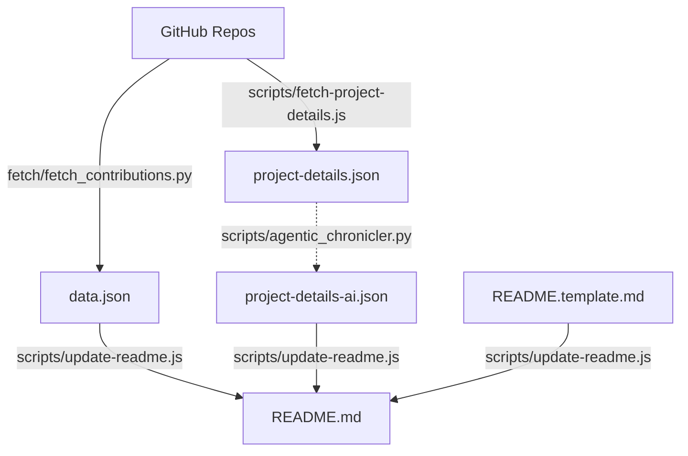

# Akash Agrawal - 2026 Engineering Portfolio

## Executive Summary

This portfolio represents a **Data & AI Product Leader** who combines strategic product thinking with deep technical execution. With **531 commits across 11 repositories** in 2025-2026, the work demonstrates a unique ability to architect and build production-grade systems that bridge **data science research**, **marketing technology**, and **agentic AI**—all while maintaining rigorous engineering practices.

## 🌐 Live Sites

- **General**: [Live Site](https://akashagl92.github.io/Portfolio/)
- **Abnormal-tailored**: [Explore](https://akashagl92.github.io/Portfolio/abnormal/)
- **Aifoundry-tailored**: [Explore](https://akashagl92.github.io/Portfolio/aifoundry/)
- **Airbnb-tailored**: [Explore](https://akashagl92.github.io/Portfolio/airbnb/)
- **Alivo-tailored**: [Explore](https://akashagl92.github.io/Portfolio/alivo/)
- **Ambience-tailored**: [Explore](https://akashagl92.github.io/Portfolio/ambience/)
- **Circle-tailored**: [Explore](https://akashagl92.github.io/Portfolio/circle/)
- **Consensys-tailored**: [Explore](https://akashagl92.github.io/Portfolio/consensys/)
- **Cresta-tailored**: [Explore](https://akashagl92.github.io/Portfolio/cresta/)
- **Ey-tailored**: [Explore](https://akashagl92.github.io/Portfolio/ey/)
- **Fedex-tailored**: [Explore](https://akashagl92.github.io/Portfolio/fedex/)
- **Happymoney-tailored**: [Explore](https://akashagl92.github.io/Portfolio/happymoney/)
- **Hershey-tailored**: [Explore](https://akashagl92.github.io/Portfolio/hershey/)
- **Kraken-tailored**: [Explore](https://akashagl92.github.io/Portfolio/kraken/)
- **Motive-tailored**: [Explore](https://akashagl92.github.io/Portfolio/motive/)
- **Quince-tailored**: [Explore](https://akashagl92.github.io/Portfolio/quince/)
- **Reku-tailored**: [Explore](https://akashagl92.github.io/Portfolio/reku/)
- **Root-tailored**: [Explore](https://akashagl92.github.io/Portfolio/root/)
- **Scopely-tailored**: [Explore](https://akashagl92.github.io/Portfolio/scopely/)
- **Stellantis-tailored**: [Explore](https://akashagl92.github.io/Portfolio/stellantis/)
- **Torq-tailored**: [Explore](https://akashagl92.github.io/Portfolio/torq/)
- **Viant-tailored**: [Explore](https://akashagl92.github.io/Portfolio/viant/)

---

## Key Themes & Differentiators

### 1. Research-Backed Product Development
The hallmark of this portfolio is the integration of **scientific rigor** into product ideation and validation. Each project demonstrates data-driven hypothesis testing before and during development.

### 2. Agentic IDE Efficiency
A core insight from this portfolio: **agentic IDEs dramatically accelerate MVP velocity while reducing costs**. This is exemplified across all projects where AI-assisted development has scaled capabilities beyond traditional manual limits.

### 3. Marketing Technology Integration
Each project embeds measurement and analytics capabilities from day one, treating instrumentation as a first-class feature.

---

## Project Deep-Dives

### Portfolio (`Portfolio`)
**HTML** | [Repo](https://github.com/akashagl92/Portfolio)

This platform dynamically generates highly-tailored, research-grade analytics and content for specific industries using an automated, production-grade system. It leverages agentic AI for content generation and robust CI/CD with GitHub Actions for deployment and synchronization across multiple customized portfolio versions. The system bridges advanced data science, marketing technology, and real-world AI applications, demonstrating sophisticated automation and data orchestration capabilities.

_Tags: Agentic AI, CI/CD Automation, Data Visualization, Dynamic Content Generation_


---

## Technical Philosophy

### CI/CD with Security-First Mindset
- **Unit testing** throughout the codebase
- **Walk-forward validation** for financial models
- **LangSmith observability** for agentic systems

### Cost Efficiency Through Agentic Development
1. **Research acceleration**: Scaling calculations and dataDS tasks via AI agents.
2. **Rapid prototyping**: Production-ready MVPs with comprehensive documentation.

---

## Summary Statistics

| Metric | Current Value |
|--------|------------|
| Total Commits | 531 |
| Unique Repositories | 11 |
| Primary Language | Python |
| Top Languages | N/A |
| Last Synced | 4/1/2026 |

---

## 🛠 Tech Stack

- Vanilla JavaScript & TypeScript
- Python (FastAPI, SciPy, LangChain)
- Neo4j Knowledge Graphs
- GitHub Actions for automated daily data updates

## 📁 Structure

```
├── index.html          → General portfolio
├── alivo/              → Alivo-tailored (Product Enthusiast)
├── consensys/          → Consensys-tailored (Market Research)
├── airbnb/             → Airbnb-tailored (Research & Discovery)
├── data.json           → GitHub activity data (Synced DAILY)
└── scripts/            → Automation & Dynamic generation
```

## 🏗 Architecture & Data Flow



## 🚀 Development

```bash
# Update GitHub stats & README (requires GITHUB_TOKEN)
python fetch/fetch_contributions.py
node scripts/update-readme.js
```


## 📝 License

MIT
