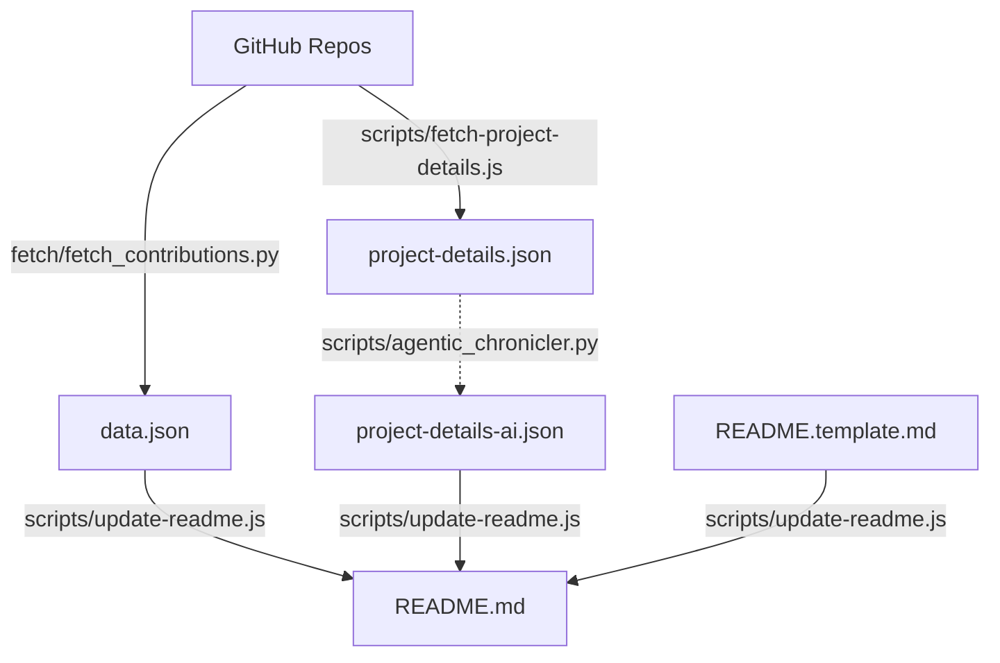

# Akash Agrawal - 2026 Engineering Portfolio

## Executive Summary

This portfolio represents a **Data & AI Product Leader** who combines strategic product thinking with deep technical execution. With **475 commits across 11 repositories** in 2025-2026, the work demonstrates a unique ability to architect and build production-grade systems that bridge **data science research**, **marketing technology**, and **agentic AI**—all while maintaining rigorous engineering practices.

## 🌐 Live Sites

- **General**: [Live Site](https://akashagl92.github.io/Portfolio/)
- **Abnormal-tailored**: [Explore](https://akashagl92.github.io/Portfolio/abnormal/)
- **Aifoundry-tailored**: [Explore](https://akashagl92.github.io/Portfolio/aifoundry/)
- **Airbnb-tailored**: [Explore](https://akashagl92.github.io/Portfolio/airbnb/)
- **Alivo-tailored**: [Explore](https://akashagl92.github.io/Portfolio/alivo/)
- **Ambience-tailored**: [Explore](https://akashagl92.github.io/Portfolio/ambience/)
- **Circle-tailored**: [Explore](https://akashagl92.github.io/Portfolio/circle/)
- **Consensys-tailored**: [Explore](https://akashagl92.github.io/Portfolio/consensys/)
- **Cresta-tailored**: [Explore](https://akashagl92.github.io/Portfolio/cresta/)
- **Ey-tailored**: [Explore](https://akashagl92.github.io/Portfolio/ey/)
- **Fedex-tailored**: [Explore](https://akashagl92.github.io/Portfolio/fedex/)
- **Happymoney-tailored**: [Explore](https://akashagl92.github.io/Portfolio/happymoney/)
- **Kraken-tailored**: [Explore](https://akashagl92.github.io/Portfolio/kraken/)
- **Quince-tailored**: [Explore](https://akashagl92.github.io/Portfolio/quince/)
- **Reku-tailored**: [Explore](https://akashagl92.github.io/Portfolio/reku/)
- **Root-tailored**: [Explore](https://akashagl92.github.io/Portfolio/root/)
- **Scopely-tailored**: [Explore](https://akashagl92.github.io/Portfolio/scopely/)
- **Stellantis-tailored**: [Explore](https://akashagl92.github.io/Portfolio/stellantis/)
- **Torq-tailored**: [Explore](https://akashagl92.github.io/Portfolio/torq/)
- **Viant-tailored**: [Explore](https://akashagl92.github.io/Portfolio/viant/)

---

## Key Themes & Differentiators

### 1. Research-Backed Product Development
The hallmark of this portfolio is the integration of **scientific rigor** into product ideation and validation. Each project demonstrates data-driven hypothesis testing before and during development.

### 2. Agentic IDE Efficiency
A core insight from this portfolio: **agentic IDEs dramatically accelerate MVP velocity while reducing costs**. This is exemplified across all projects where AI-assisted development has scaled capabilities beyond traditional manual limits.

### 3. Marketing Technology Integration
Each project embeds measurement and analytics capabilities from day one, treating instrumentation as a first-class feature.

---

## Project Deep-Dives

### Portfolio (`Portfolio`)
**HTML** | [Repo](https://github.com/akashagl92/Portfolio)

This dynamic portfolio platform leverages agentic AI for automated content generation and a scalable architecture to deliver industry-specific, research-grade analytics. It utilizes vanilla JS/HTML/CSS, Chart.js, and JSON data, supported by robust GitHub Actions for CI/CD and static site generation. The system showcases production-ready automation, effectively bridging data science research, marketing technology, and real-world AI applications through tailored, data-driven content.

_Tags: Agentic AI, Static Site Generation, CI/CD Automation, Data Visualization_

---

### 📲 Moltbot - AI WhatsApp Agent (`moltbot`)
**TypeScript** | [Repo](https://github.com/akashagl92/moltbot)

This advanced personal AI agent platform pioneers scalable, persistent memory for LLMs, leveraging Recursive Gated Consolidation (RGC) and Structured State Convergence (SSC) to achieve 100% memory fidelity across millions of conversation turns. It integrates sophisticated state management, planning, and tool-use capabilities with diverse external services, including a job-hunter feature and IDE extensions, pushing the boundaries of agentic AI and natural language processing.

_Tags: LLM Agents, Persistent Memory, Polyglot Development, Containerization_

---

### 📈 Autonomous Trading System (`stock_price_target_modelling`)
**Python** | [Repo](https://github.com/akashagl92/stock_price_target_modelling)

This autonomous AI-powered system manages a dual-track stock and crypto portfolio, employing a multi-tier 'Steady Winner' strategy with Golden Cross momentum boosting. It optimizes for realized wealth and tax efficiency, achieving an 80.8% XIRR and 60.3% Alpha over the S&P 500. The system integrates financial data, automates execution, and provides robust email-based reporting and approval workflows.

_Tags: Quantitative Finance, Machine Learning, Automated Trading, DevOps Automation_

---

### 🤖 IDE-Agnostic Agent Orchestrator (`ide-agnostic-agent-orchestrator`)
**Shell** | [Repo](https://github.com/akashagl92/ide-agnostic-agent-orchestrator)

This IDE-agnostic orchestration framework unifies AI-assisted software delivery across diverse development environments, eliminating workflow fragmentation. It enforces policy-first execution and integrates a multi-layered native artifact safety stack, including circuit breakers and idempotent retries, to guarantee reliable and controlled AI operations. The system manages complex agent execution, ensuring data integrity and fault tolerance through an event-driven architecture.

_Tags: AI Orchestration, IDE-Agnostic, Policy Enforcement, Fault Tolerance_

---

### Agentic-memory-scaling (`agentic-memory-scaling`)
**Python** | [Repo](https://github.com/akashagl92/agentic-memory-scaling)

Introduces Recursive Gated Consolidation (RGC), an innovative architecture that overcomes the 'Discovery Cliff' in LLM agent memory. It achieves O(1) memory scaling, maintaining 100% signal recall across 10^7 turns where standard methods fail. Utilizing Python, LLM APIs like Gemini and Claude, and extensive Monte Carlo simulations, the system validates an 'Inverted Latency Law' through hardware-grounded analysis, fundamentally redefining long-term memory for intelligent agents.

_Tags: LLM Agent Memory, Recursive Gated Consolidation, Scalable AI Architectures, Monte Carlo Simulation_


---

## Technical Philosophy

### CI/CD with Security-First Mindset
- **Unit testing** throughout the codebase
- **Walk-forward validation** for financial models
- **LangSmith observability** for agentic systems

### Cost Efficiency Through Agentic Development
1. **Research acceleration**: Scaling calculations and dataDS tasks via AI agents.
2. **Rapid prototyping**: Production-ready MVPs with comprehensive documentation.

---

## Summary Statistics

| Metric | Current Value |
|--------|------------|
| Total Commits | 475 |
| Unique Repositories | 11 |
| Primary Language | Python |
| Top Languages | Python (58.5%), HTML (25.9%), TypeScript (12.4%) |
| Last Synced | 3/12/2026 |

---

## 🛠 Tech Stack

- Vanilla JavaScript & TypeScript
- Python (FastAPI, SciPy, LangChain)
- Neo4j Knowledge Graphs
- GitHub Actions for automated daily data updates

## 📁 Structure

```
├── index.html          → General portfolio
├── alivo/              → Alivo-tailored (Product Enthusiast)
├── consensys/          → Consensys-tailored (Market Research)
├── airbnb/             → Airbnb-tailored (Research & Discovery)
├── data.json           → GitHub activity data (Synced DAILY)
└── scripts/            → Automation & Dynamic generation
```

## 🏗 Architecture & Data Flow



## 🚀 Development

```bash
# Update GitHub stats & README (requires GITHUB_TOKEN)
python fetch/fetch_contributions.py
node scripts/update-readme.js
```


## 📝 License

MIT
