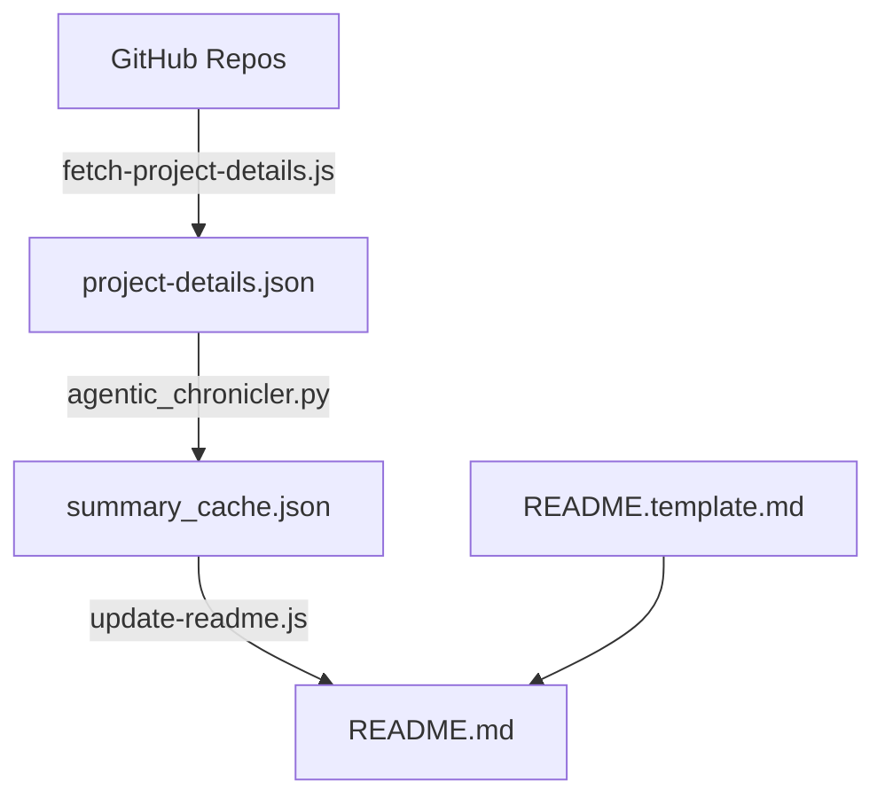

# Akash Agrawal - 2026 Engineering Portfolio

## Executive Summary

This portfolio represents a **Data & AI Product Leader** who combines strategic product thinking with deep technical execution. With **403 commits across 10 repositories** in 2025-2026, the work demonstrates a unique ability to architect and build production-grade systems that bridge **data science research**, **marketing technology**, and **agentic AI**—all while maintaining rigorous engineering practices.

## 🌐 Live Sites

- **General**: [Live Site](https://akashagl92.github.io/Portfolio/)
- **Airbnb-tailored**: [Explore](https://akashagl92.github.io/Portfolio/airbnb/)
- **Alivo-tailored**: [Explore](https://akashagl92.github.io/Portfolio/alivo/)
- **Ambience-tailored**: [Explore](https://akashagl92.github.io/Portfolio/ambience/)
- **Circle-tailored**: [Explore](https://akashagl92.github.io/Portfolio/circle/)
- **Consensys-tailored**: [Explore](https://akashagl92.github.io/Portfolio/consensys/)
- **Ey-tailored**: [Explore](https://akashagl92.github.io/Portfolio/ey/)
- **Fedex-tailored**: [Explore](https://akashagl92.github.io/Portfolio/fedex/)
- **Happymoney-tailored**: [Explore](https://akashagl92.github.io/Portfolio/happymoney/)
- **Kraken-tailored**: [Explore](https://akashagl92.github.io/Portfolio/kraken/)
- **Quince-tailored**: [Explore](https://akashagl92.github.io/Portfolio/quince/)
- **Reku-tailored**: [Explore](https://akashagl92.github.io/Portfolio/reku/)
- **Root-tailored**: [Explore](https://akashagl92.github.io/Portfolio/root/)
- **Scopely-tailored**: [Explore](https://akashagl92.github.io/Portfolio/scopely/)
- **Stellantis-tailored**: [Explore](https://akashagl92.github.io/Portfolio/stellantis/)
- **Torq-tailored**: [Explore](https://akashagl92.github.io/Portfolio/torq/)
- **Viant-tailored**: [Explore](https://akashagl92.github.io/Portfolio/viant/)

---

## Key Themes & Differentiators

### 1. Research-Backed Product Development
The hallmark of this portfolio is the integration of **scientific rigor** into product ideation and validation. Each project demonstrates data-driven hypothesis testing before and during development.

### 2. Agentic IDE Efficiency
A core insight from this portfolio: **agentic IDEs dramatically accelerate MVP velocity while reducing costs**. This is exemplified across all projects where AI-assisted development has scaled capabilities beyond traditional manual limits.

### 3. Marketing Technology Integration
Each project embeds measurement and analytics capabilities from day one, treating instrumentation as a first-class feature.

---

## Project Deep-Dives

### 🔮 AI Astrology Platform (`aistro.ai`)
**Python** | [Repo](https://github.com/akashagl92/aistro.ai)

This advanced AI platform provides comprehensive astrological analysis across Western, Vedic, and Horary systems. It leverages precise astronomical calculations and Google Gemini for AI-powered, statistically validated interpretations. Built with Next.js and FastAPI, it offers interactive charts, predictive insights, and robust data science integration, backed by research on over 12,000 events.

_Tags: AI/ML, Full-Stack Development, Data Science, Astrology Engine_

---

### 📲 Moltbot - AI WhatsApp Agent (`moltbot`)
**TypeScript** | [Repo](https://github.com/akashagl92/moltbot)

Moltbot is a cutting-edge personal AI agent platform that revolutionizes LLM memory by overcoming attention saturation. Utilizing Recursive Gated Consolidation (RGC) and Structured State Convergence (SSC), it achieves 100% discovery fidelity over 10 million conversation turns with O(1) query latency. This research-grade system provides persistent, scalable agentic memory, pushing the boundaries of AI interaction and long-term context retention.

_Tags: LLM Memory Management, AI Agent Systems, Container Orchestration, Polyglot Development_

---

### 📈 Autonomous Trading System (`stock_price_target_modelling`)
**Python** | [Repo](https://github.com/akashagl92/stock_price_target_modelling)

This autonomous AI-powered trading system dynamically manages a dual-track portfolio across stocks and crypto. It employs a sophisticated multi-tier strategy with Golden Cross momentum boosting, achieving significant XIRR performance by optimizing realized wealth. The system features automated execution with email-based approval, robust data pipelines, and shadow portfolio tracking for rigorous validation.

_Tags: Algorithmic Trading, Python, Financial Automation, Quantitative Finance_

---

### 🎹 Sonic Geometry Visualizer (`Music-and-Math`)
**JavaScript** | [Repo](https://github.com/akashagl92/Music-and-Math)

Sonic Geometry is an interactive web-based visualizer that merges Music Theory, Sound Physics, and Mathematics through real-time visualizations of sound waves, frequencies, and harmony. Utilizing advanced technologies like Web Audio API and HTML5 Canvas, the project offers interactive learning tools, virtual instruments, and guided lessons. With a focus on native performance and custom implementation, Sonic Geometry provides an immersive experience for users to explore the intricate connections between music and math.

_Tags: Vanilla JavaScript, Web Audio API, HTML5 Canvas, CSS3, Music Theory_

---

### Portfolio (`Portfolio`)
**JavaScript** | [Repo](https://github.com/akashagl92/Portfolio)

This portfolio showcases a Data & AI Product Leader adept at architecting and deploying production-grade systems across data science, marketing technology, and agentic AI. It features an autonomous trading system with a 40.8% XIRR, AI-powered personal agents, and interactive visualizers. The platform itself leverages sophisticated automation for personalized content delivery, demonstrating a strong grasp of advanced technologies and efficient development workflows.

_Tags: AI/Machine Learning, Data Science, Autonomous Systems, Web Development_

---

### Agentic-memory-scaling (`agentic-memory-scaling`)
**Python** | [Repo](https://github.com/akashagl92/agentic-memory-scaling)

This research identifies the "Discovery Cliff," a fundamental scaling limit where LLM-based agents lose critical information in long conversation histories due to temporal decay. The novel Recursive Gated Consolidation (RGC) architecture rigorously overcomes this, maintaining 100% signal recall at over 10 million turns by decoupling discovery from synthesis, significantly advancing agentic memory capabilities.

_Tags: LLM Agentic Systems, Memory Consolidation, Scaling Laws, AI Benchmarking_

---

### Philosophy-sage (`philosophy-sage`)
**TypeScript** | [Repo](https://github.com/akashagl92/philosophy-sage)

Advanced AI platform for philosophical and scriptural text analysis

_Tags: Natural Language Processing, Semantic Search, Graph Databases_


---

## Technical Philosophy

### CI/CD with Security-First Mindset
- **Unit testing** throughout the codebase
- **Walk-forward validation** for financial models
- **LangSmith observability** for agentic systems

### Cost Efficiency Through Agentic Development
1. **Research acceleration**: Scaling calculations and dataDS tasks via AI agents.
2. **Rapid prototyping**: Production-ready MVPs with comprehensive documentation.

---

## Summary Statistics

| Metric | Current Value |
|--------|------------|
| Total Commits | 403 |
| Unique Repositories | 10 |
| Primary Language | Python |
| Top Languages | N/A |
| Last Synced | 2/26/2026 |

---

## 🛠 Tech Stack

- Vanilla JavaScript & TypeScript
- Python (FastAPI, SciPy, LangChain)
- Neo4j Knowledge Graphs
- GitHub Actions for automated daily data updates

## 📁 Structure

```
├── index.html          → General portfolio
├── alivo/              → Alivo-tailored (Product Enthusiast)
├── consensys/          → Consensys-tailored (Market Research)
├── airbnb/             → Airbnb-tailored (Research & Discovery)
├── data.json           → GitHub activity data (Synced DAILY)
└── scripts/            → Automation & Dynamic generation
```

## 🏗 Architecture & Data Flow



## 🚀 Development

```bash
# Update GitHub stats & README (requires GITHUB_TOKEN)
node scripts/fetch-github.js
node scripts/update-readme.js
```

## 📝 License

MIT
