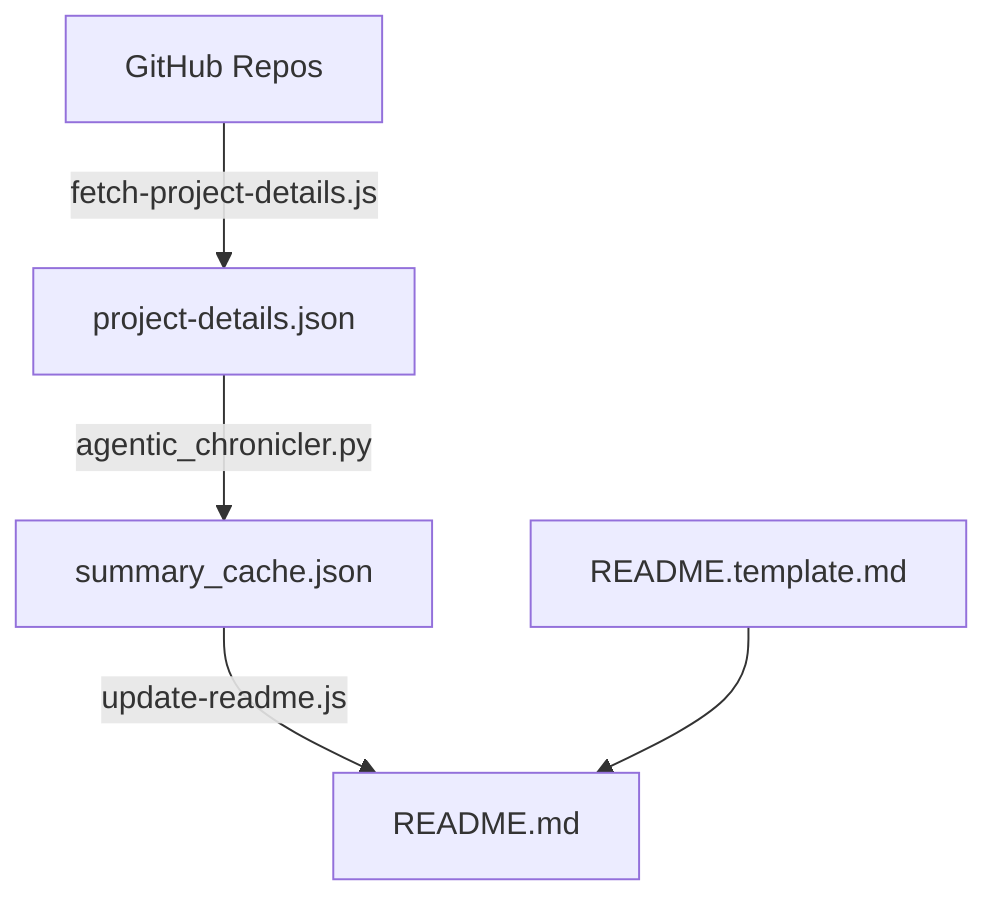

# Akash Agrawal - 2026 Engineering Portfolio

## Executive Summary

This portfolio represents a **Data & AI Product Leader** who combines strategic product thinking with deep technical execution. With **8731 commits across 11 repositories** in 2025-2026, the work demonstrates a unique ability to architect and build production-grade systems that bridge **data science research**, **marketing technology**, and **agentic AI**—all while maintaining rigorous engineering practices.

## 🌐 Live Sites

- **General**: [Live Site](https://akashagl92.github.io/Portfolio/)
- **Airbnb-tailored**: [Explore](https://akashagl92.github.io/Portfolio/airbnb/)
- **Alivo-tailored**: [Explore](https://akashagl92.github.io/Portfolio/alivo/)
- **Ambience-tailored**: [Explore](https://akashagl92.github.io/Portfolio/ambience/)
- **Circle-tailored**: [Explore](https://akashagl92.github.io/Portfolio/circle/)
- **Consensys-tailored**: [Explore](https://akashagl92.github.io/Portfolio/consensys/)
- **Fedex-tailored**: [Explore](https://akashagl92.github.io/Portfolio/fedex/)
- **Happymoney-tailored**: [Explore](https://akashagl92.github.io/Portfolio/happymoney/)
- **Kraken-tailored**: [Explore](https://akashagl92.github.io/Portfolio/kraken/)
- **Quince-tailored**: [Explore](https://akashagl92.github.io/Portfolio/quince/)
- **Reku-tailored**: [Explore](https://akashagl92.github.io/Portfolio/reku/)
- **Root-tailored**: [Explore](https://akashagl92.github.io/Portfolio/root/)
- **Scopely-tailored**: [Explore](https://akashagl92.github.io/Portfolio/scopely/)
- **Stellantis-tailored**: [Explore](https://akashagl92.github.io/Portfolio/stellantis/)
- **Torq-tailored**: [Explore](https://akashagl92.github.io/Portfolio/torq/)
- **Viant-tailored**: [Explore](https://akashagl92.github.io/Portfolio/viant/)

---

## Key Themes & Differentiators

### 1. Research-Backed Product Development
The hallmark of this portfolio is the integration of **scientific rigor** into product ideation and validation. Each project demonstrates data-driven hypothesis testing before and during development.

### 2. Agentic IDE Efficiency
A core insight from this portfolio: **agentic IDEs dramatically accelerate MVP velocity while reducing costs**. This is exemplified across all projects where AI-assisted development has scaled capabilities beyond traditional manual limits.

### 3. Marketing Technology Integration
Each project embeds measurement and analytics capabilities from day one, treating instrumentation as a first-class feature.

---

## Project Deep-Dives

### 🔮 AI Astrology Platform (`aistro.ai`)
**Python** | [Repo](https://github.com/akashagl92/aistro.ai)

AI-powered astrological analysis platform with multi-system support and personalized insights

_Tags: Astrology, AI, Next.js_

---

### 📲 Moltbot - AI WhatsApp Agent (`moltbot`)
**TypeScript** | [Repo](https://github.com/akashagl92/moltbot)

Moltbot is an autonomous AI assistant for personal and family use, featuring unified messaging and advanced codebase management.

_Tags: AI, Machine Learning, Containerization_

---

### 📈 Autonomous Trading System (`stock_price_target_modelling`)
**Python** | [Repo](https://github.com/akashagl92/stock_price_target_modelling)

AI-powered autonomous trading system with 40.8% XIRR, leveraging multi-tier strategy and market timing factors

_Tags: Python, Autonomous Trading, Portfolio Management_

---

### 🎹 Sonic Geometry Visualizer (`Music-and-Math`)
**JavaScript** | [Repo](https://github.com/akashagl92/Music-and-Math)

Sonic Geometry is an interactive web-based visualizer that merges Music Theory, Sound Physics, and Mathematics through real-time visualizations of sound waves, frequencies, and harmony. Utilizing advanced technologies like Web Audio API and HTML5 Canvas, the project offers interactive learning tools, virtual instruments, and guided lessons. With a focus on native performance and custom implementation, Sonic Geometry provides an immersive experience for users to explore the intricate connections between music and math.

_Tags: Vanilla JavaScript, Web Audio API, HTML5 Canvas, CSS3, Music Theory_

---

### Portfolio (`Portfolio`)
**JavaScript** | [Repo](https://github.com/akashagl92/Portfolio)

Data & AI product leader with 231 commits across 10 repositories, showcasing research-backed development and agentic IDE efficiency.

_Tags: Data Science, AI, Product Leadership_

---

### Philosophy-sage (`philosophy-sage`)
**TypeScript** | [Repo](https://github.com/akashagl92/philosophy-sage)

Philosophy-sage integrates AI-driven semantic search and allegorical interpretations for philosophical inquiry

_Tags: Natural Language Processing, Machine Learning, Semantic Search_

---

### Databricks-Genie-Integration (`Databricks-Genie-Integration`)
**Python** | [Repo](https://github.com/akashagl92/Databricks-Genie-Integration)

Developed a sophisticated web application, Databricks Genie Integration, facilitating seamless connectivity between Databricks workspaces and business intelligence tools for enhanced data lookup and enrichment capabilities. The project features multi-workspace support, pre-built queries, natural language query support, and advanced data enrichment functionalities, utilizing a technology stack including Python Flask, Databricks SQL, HTML, CSS, JavaScript, Pandas, SQL, and Databricks Connect for authentication.

_Tags: Python Flask, Databricks SQL, Pandas, Data Processing, Databricks Connect_


---

## Technical Philosophy

### CI/CD with Security-First Mindset
- **Unit testing** throughout the codebase
- **Walk-forward validation** for financial models
- **LangSmith observability** for agentic systems

### Cost Efficiency Through Agentic Development
1. **Research acceleration**: Scaling calculations and dataDS tasks via AI agents.
2. **Rapid prototyping**: Production-ready MVPs with comprehensive documentation.

---

## Summary Statistics

| Metric | Current Value |
|--------|------------|
| Total Commits | 8731 |
| Unique Repositories | 11 |
| Primary Language | TypeScript |
| Top Languages | TypeScript (95.2%), Python (3.0%), JavaScript (1.7%) |
| Last Synced | 2/1/2026 |

---

## 🛠 Tech Stack

- Vanilla JavaScript & TypeScript
- Python (FastAPI, SciPy, LangChain)
- Neo4j Knowledge Graphs
- GitHub Actions for automated daily data updates

## 📁 Structure

```
├── index.html          → General portfolio
├── alivo/              → Alivo-tailored (Product Enthusiast)
├── consensys/          → Consensys-tailored (Market Research)
├── airbnb/             → Airbnb-tailored (Research & Discovery)
├── data.json           → GitHub activity data (Synced DAILY)
└── scripts/            → Automation & Dynamic generation
```

## 🏗 Architecture & Data Flow



## 🚀 Development

```bash
# Update GitHub stats & README (requires GITHUB_TOKEN)
node scripts/fetch-github.js
node scripts/update-readme.js
```

## 📝 License

MIT
