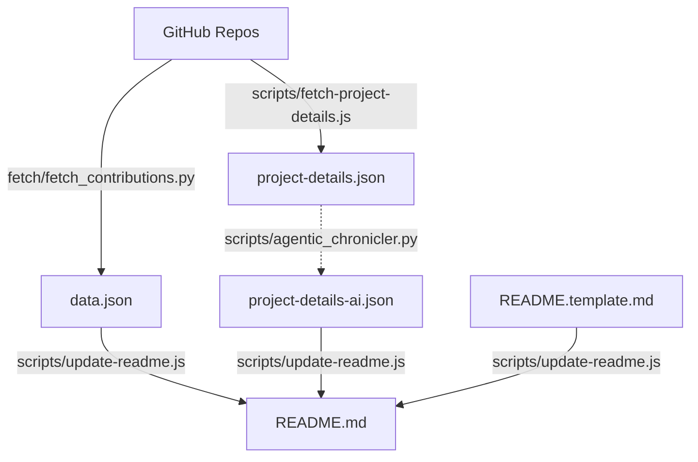

# Akash Agrawal - 2026 Engineering Portfolio

## Executive Summary

This portfolio represents a **Data & AI Product Leader** who combines strategic product thinking with deep technical execution. With **470 commits across 11 repositories** in 2025-2026, the work demonstrates a unique ability to architect and build production-grade systems that bridge **data science research**, **marketing technology**, and **agentic AI**—all while maintaining rigorous engineering practices.

## 🌐 Live Sites

- **General**: [Live Site](https://akashagl92.github.io/Portfolio/)
- **Abnormal-tailored**: [Explore](https://akashagl92.github.io/Portfolio/abnormal/)
- **Aifoundry-tailored**: [Explore](https://akashagl92.github.io/Portfolio/aifoundry/)
- **Airbnb-tailored**: [Explore](https://akashagl92.github.io/Portfolio/airbnb/)
- **Alivo-tailored**: [Explore](https://akashagl92.github.io/Portfolio/alivo/)
- **Ambience-tailored**: [Explore](https://akashagl92.github.io/Portfolio/ambience/)
- **Circle-tailored**: [Explore](https://akashagl92.github.io/Portfolio/circle/)
- **Consensys-tailored**: [Explore](https://akashagl92.github.io/Portfolio/consensys/)
- **Ey-tailored**: [Explore](https://akashagl92.github.io/Portfolio/ey/)
- **Fedex-tailored**: [Explore](https://akashagl92.github.io/Portfolio/fedex/)
- **Happymoney-tailored**: [Explore](https://akashagl92.github.io/Portfolio/happymoney/)
- **Kraken-tailored**: [Explore](https://akashagl92.github.io/Portfolio/kraken/)
- **Quince-tailored**: [Explore](https://akashagl92.github.io/Portfolio/quince/)
- **Reku-tailored**: [Explore](https://akashagl92.github.io/Portfolio/reku/)
- **Root-tailored**: [Explore](https://akashagl92.github.io/Portfolio/root/)
- **Scopely-tailored**: [Explore](https://akashagl92.github.io/Portfolio/scopely/)
- **Stellantis-tailored**: [Explore](https://akashagl92.github.io/Portfolio/stellantis/)
- **Torq-tailored**: [Explore](https://akashagl92.github.io/Portfolio/torq/)
- **Viant-tailored**: [Explore](https://akashagl92.github.io/Portfolio/viant/)

---

## Key Themes & Differentiators

### 1. Research-Backed Product Development
The hallmark of this portfolio is the integration of **scientific rigor** into product ideation and validation. Each project demonstrates data-driven hypothesis testing before and during development.

### 2. Agentic IDE Efficiency
A core insight from this portfolio: **agentic IDEs dramatically accelerate MVP velocity while reducing costs**. This is exemplified across all projects where AI-assisted development has scaled capabilities beyond traditional manual limits.

### 3. Marketing Technology Integration
Each project embeds measurement and analytics capabilities from day one, treating instrumentation as a first-class feature.

---

## Project Deep-Dives

### Portfolio (`Portfolio`)
**HTML** | [Repo](https://github.com/akashagl92/Portfolio)

A dynamic portfolio platform integrating agentic AI, data science, and product leadership, featuring automated content generation via JSON data, GitHub Actions for CI/CD, and scalable architecture for industry-specific projects. Delivers research-grade analytics and AI-driven solutions with production-ready automation.

_Tags: agentic AI, static site generation, GitHub Actions, JSON data management_

---

### 📲 Moltbot - AI WhatsApp Agent (`moltbot`)
**TypeScript** | [Repo](https://github.com/akashagl92/moltbot)

A research-grade AI agent platform with persistent memory across 10M+ interactions, using Recursive Gated Consolidation (RGC) and Structured State Convergence (SSC) for 100% recall fidelity. Built with Python, Docker, and macOS Metal acceleration for industrial-scale memory benchmarking.

_Tags: AI/ML, Python, Docker_

---

### 📈 Autonomous Trading System (`stock_price_target_modelling`)
**Python** | [Repo](https://github.com/akashagl92/stock_price_target_modelling)

A production-grade autonomous trading system combining AI-driven financial engineering with risk-adjusted portfolio optimization. The v4.1 Steady Winner strategy achieves 80.8% XIRR (60.3% Alpha over S&P 500) through dual-track asset allocation, Golden Cross momentum, and real-time Shadow Portfolio tracking. Features include tax-efficient execution, statistical verification, and tiered risk management for crypto-stocks hybrid portfolios.

_Tags: autonomous-trading, financial-modeling, machine-learning_

---

### 🔮 AI Astrology Platform (`aistro.ai`)
**Python** | [Repo](https://github.com/akashagl92/aistro.ai)

A research-validated astrological analysis platform integrating Swiss Ephemeris precision with AI-driven interpretations. Combines Western, Vedic, and Horary systems via FastAPI/Next.js, featuring divisional charts, dasha calculations, and geopolitical entity analysis. Employs Jest for testing and Render for deployment, with AI-powered dosha/yoga diagnostics and predictive analytics.

_Tags: FastAPI, Next.js, TypeScript, Jest_

---

### 🤖 IDE-Agnostic Agent Orchestrator (`ide-agnostic-agent-orchestrator`)
**Shell** | [Repo](https://github.com/akashagl92/ide-agnostic-agent-orchestrator)

An IDE-agnostic orchestration framework that unifies AI agent workflows across development environments. It decouples core safety policies—like runtime locks, circuit breakers, and policy-first execution—from IDE-specific adapters, enabling consistent AI-assisted coding without tooling lock-in. Modular design ensures portable runtime guarantees across CLIs, editors, and projects via a single, enforceable quality and telemetry stack.

_Tags: AI orchestration, runtime safety, modular architecture, policy enforcement_

---

### 🎹 Sonic Geometry Visualizer (`Music-and-Math`)
**JavaScript** | [Repo](https://github.com/akashagl92/Music-and-Math)

An interactive web-based visualizer merging music theory and sound physics, enabling real-time exploration of harmonic ratios, wave interference, and acoustic principles through Web Audio API and HTML5 Canvas. Combines educational value with performance-optimized audio-visual synthesis for dynamic learning experiences.

_Tags: Web Audio API, HTML5 Canvas, music theory_

---

### Agentic-memory-scaling (`agentic-memory-scaling`)
**Python** | [Repo](https://github.com/akashagl92/agentic-memory-scaling)

A high-fidelity framework for O(1) memory scaling in LLM agents, resolving the Discovery Cliff with Recursive Gated Consolidation (RGC) to maintain 100% recall at 10M+ conversation turns. Leverages TPU v4/v5 and SparseCore hardware for latency-optimized pathways, validated across Gemini 3.0, Claude 4.6, and real-world systems.

_Tags: LLM memory scaling, Recursive Gated Consolidation, TPU optimization_

---

### Philosophy-sage (`philosophy-sage`)
**TypeScript** | [Repo](https://github.com/akashagl92/philosophy-sage)

A multi-scripture AI philosopher integrating semantic search, hybrid RAG, and adaptive layout learning to enable Q&A, allegorical analysis, and TTS-driven exploration of texts like the Mahabharata and Ashtavakra Gita. Combines Neo4j graph databases with Cytoscape.js visualizations for cross-cultural philosophical synthesis.

_Tags: semantic_search, rag, neo4j, tts_

---

### Pi-home-assistant (`pi-home-assistant`)
 | [Repo](https://github.com/akashagl92/pi-home-assistant)

A Raspberry Pi-powered home automation system that integrates IoT devices with custom logic and lightweight machine learning models, enabling real-time adaptive control of smart environments without proprietary platforms.

_Tags: Raspberry Pi, IoT Automation, Machine Learning_

---

### Databricks-Genie-Integration (`Databricks-Genie-Integration`)
**Python** | [Repo](https://github.com/akashagl92/Databricks-Genie-Integration)

An intelligent data integration platform combining Databricks workspaces with Genie's AI-driven natural language querying, enabling real-time business intelligence through multi-workspace orchestration and bulk data enrichment. Built with Python Flask, Databricks SQL, and Pandas, it empowers users to extract actionable insights via conversational queries or Excel/CSV uploads, bridging complex analytics with intuitive workflows.

_Tags: Python, Databricks, Flask, AI Integration_

---

### Hindi-Tutor (`Hindi-Tutor`)
**TypeScript** | [Repo](https://github.com/akashagl92/Hindi-Tutor)

An AI-powered Hindi tutor leveraging Gemini API for real-time, personalized language practice, built with React/TypeScript and PWA capabilities for offline access. Combines conversational learning with adaptive speech recognition to tailor Hindi skill development.

_Tags: React, TypeScript, AI/ML, PWA_

---

### Voc-buyer-journey-chatbot (`voc-buyer-journey-chatbot`)
**Python** | [Repo](https://github.com/akashagl92/voc-buyer-journey-chatbot)

A production-ready chatbot leveraging LangChain and LangGraph for orchestration, integrating Databricks Vector Search and RAG for structured/unstructured data analysis. Delivers real-time Voice of Customer insights via a dual-brain architecture, optimized for enterprise scalability with Streamlit UI.

_Tags: LangChain, LangGraph, Databricks Vector Search, RAG_


---

## Technical Philosophy

### CI/CD with Security-First Mindset
- **Unit testing** throughout the codebase
- **Walk-forward validation** for financial models
- **LangSmith observability** for agentic systems

### Cost Efficiency Through Agentic Development
1. **Research acceleration**: Scaling calculations and dataDS tasks via AI agents.
2. **Rapid prototyping**: Production-ready MVPs with comprehensive documentation.

---

## Summary Statistics

| Metric | Current Value |
|--------|------------|
| Total Commits | 470 |
| Unique Repositories | 11 |
| Primary Language | Python |
| Top Languages | N/A |
| Last Synced | 3/10/2026 |

---

## 🛠 Tech Stack

- Vanilla JavaScript & TypeScript
- Python (FastAPI, SciPy, LangChain)
- Neo4j Knowledge Graphs
- GitHub Actions for automated daily data updates

## 📁 Structure

```
├── index.html          → General portfolio
├── alivo/              → Alivo-tailored (Product Enthusiast)
├── consensys/          → Consensys-tailored (Market Research)
├── airbnb/             → Airbnb-tailored (Research & Discovery)
├── data.json           → GitHub activity data (Synced DAILY)
└── scripts/            → Automation & Dynamic generation
```

## 🏗 Architecture & Data Flow



## 🚀 Development

```bash
# Update GitHub stats & README (requires GITHUB_TOKEN)
python fetch/fetch_contributions.py
node scripts/update-readme.js
```


## 📝 License

MIT
